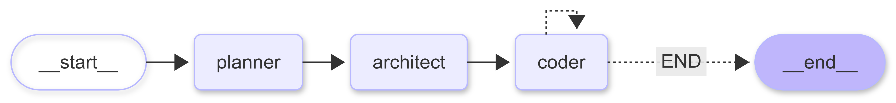

# 🛠️ Coder Uncle

**Coder Uncle** is an AI-powered coding assistant built with [LangGraph](https://github.com/langchain-ai/langgraph).  
It works like a multi-agent development team that can take a natural language request and transform it into a complete, working project — file by file — using real developer workflows.

**Coder Uncle（コーダーアンクル）**は、[LangGraph](https://github.com/langchain-ai/langgraph) を活用した AI コーディングアシスタントです。  
自然言語でのリクエストを受け取り、実際の開発者のワークフローのようにファイル単位で完全なプロジェクトを生成します。

---

## 🌐 Live Demo / ライブデモ

👉 [Try the project on Hugging Face Spaces](https://huggingface.co/spaces/Jewelr16/Create_new_project)  
👉 [Hugging Face Spaces でこのプロジェクトを試す](https://huggingface.co/spaces/Jewelr16/Create_new_project)

---

---

## 📖 Table of Contents / 目次

- [How to Use / 使い方](#how-to-use--使い方)
- [Notes / 注意事項](#notes--注意事項)
- [🏗️ Architecture / アーキテクチャ](#-architecture--アーキテクチャ)
- [🚀 Getting Started / セットアップ手順](#-getting-started--セットアップ手順)
  - [Installation & Startup / インストールと起動](#installation--startup--インストールと起動)
  - [Windows PowerShell Virtual Environment / Windows での仮想環境](#windows-powershell-virtual-environment--windows-での仮想環境)
- [🧪 Example Prompts / サンプルプロンプト](#-example-prompts--サンプルプロンプト)
- [📜 License / ライセンス](#-license--ライセンス)

---

## How to Use / 使い方

### English

1. Enter a prompt.
2. Click **Generate**.
3. Watch logs & preview.
4. Click the preview link to open in a new tab.
5. Click **Download ZIP** to get the generated site.
6. Extract the files and use them locally.

### 日本語

1. プロンプトを入力します。
2. **Generate** をクリックします。
3. ログとプレビューを確認します。
4. プレビューリンクを新しいタブで開きます。
5. **Download ZIP** をクリックして生成されたサイトを取得します。
6. ZIP ファイルを展開し、利用を開始します。

---

## 🧪 Example Prompts / サンプルプロンプト

### 1. To-do list app

**English:** Create a to-do list application using HTML, CSS, and JavaScript.  
**日本語:** HTML、CSS、JavaScript を使って To-do リストアプリを作成してください。

---

### 2. Calculator app

**English:** Create a simple calculator web application.  
**日本語:** シンプルな電卓の Web アプリケーションを作成してください。

---

### 3. Hello World page

**English:** Write a simple `index.html` file with big text **Hello World**.  
**日本語:** 大きな文字で **Hello World** と表示するシンプルな `index.html` ファイルを書いてください。

---

### 4. Prema I love you (animated)

**English:** Write a simple `index.html` file with big text **Prema I love you** and add CSS animations for a joyful vibe.  
**日本語:** 大きな文字で **Prema I love you** と表示し、CSS アニメーションで楽しい雰囲気を演出する `index.html` ファイルを書いてください。

---

### 5. Prema I Love You Forever (typewriter effect)

**English:** Write an `index.html` where the text **Prema I Love You Forever** types letter by letter with a blinking cursor animation.  
**日本語:** **Prema I Love You Forever** というテキストが一文字ずつタイプされ、カーソルが点滅するアニメーションを持つ `index.html` を作成してください。

---

### 6. Prema 💖 (neon glow)

**English:** Make an `index.html` where the text **Prema 💖** glows like neon lights on a black background.  
**日本語:** 黒い背景で **Prema 💖** のテキストがネオンライトのように光る `index.html` を作成してください。

## Notes / 注意事項

### English

- If the model is rate-limited or no API key is set, the demo falls back to **MOCK mode**, so you will still see a working preview and ZIP.

### 日本語

- モデルがレート制限されている場合、または API キーが設定されていない場合、デモは **MOCK モード** に切り替わります。そのため、プレビューと ZIP を引き続き利用できます。

---

## 🏗️ Architecture / アーキテクチャ

- **Planner Agent** – Analyzes your request and generates a detailed project plan.
- **Architect Agent** – Breaks down the plan into specific engineering tasks with explicit context for each file.
- **Coder Agent** – Implements each task, writes directly into files, and uses available tools like a real developer.

- **Planner Agent（プランナーエージェント）** – リクエストを解析し、詳細なプロジェクト計画を作成します。
- **Architect Agent（アーキテクトエージェント）** – 計画を具体的なエンジニアリングタスクに分解し、各ファイルの文脈を付与します。
- **Coder Agent（コーダーエージェント）** – タスクを実装し、ファイルに直接コードを書き込み、開発ツールを使用します。

<div style="text-align: center;">
  
</div>

---

## 🚀 Getting Started / セットアップ手順

### Installation & Startup / インストールと起動

#### English

1. Create a virtual environment:
   ```bash
   uv venv
   ```
   Activate the environment:

source .venv/bin/activate

Install dependencies:

uv pip install -r pyproject.toml

Or:

uv pip install -r requirements.txt

Create a .env file and add the variables listed in .sample_env.

Run the application:

python app.py

日本語

仮想環境を作成:

uv venv

仮想環境を有効化:

source .venv/bin/activate

依存関係をインストール:

uv pip install -r pyproject.toml

または:

uv pip install -r requirements.txt

.env ファイルを作成し、.sample_env に記載されている環境変数を追加します。

アプリケーションを起動:

python app.py

Windows PowerShell Virtual Environment / Windows での仮想環境
English
uv
.venv\Scripts\activate

日本語
uv
.venv\Scripts\activate

📜 License / ライセンス

Copyright © Norul Islam
All rights reserved. / 無断転載禁止
